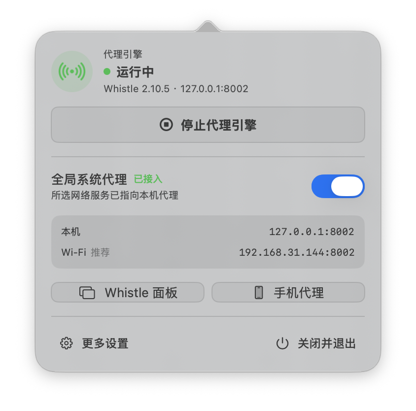
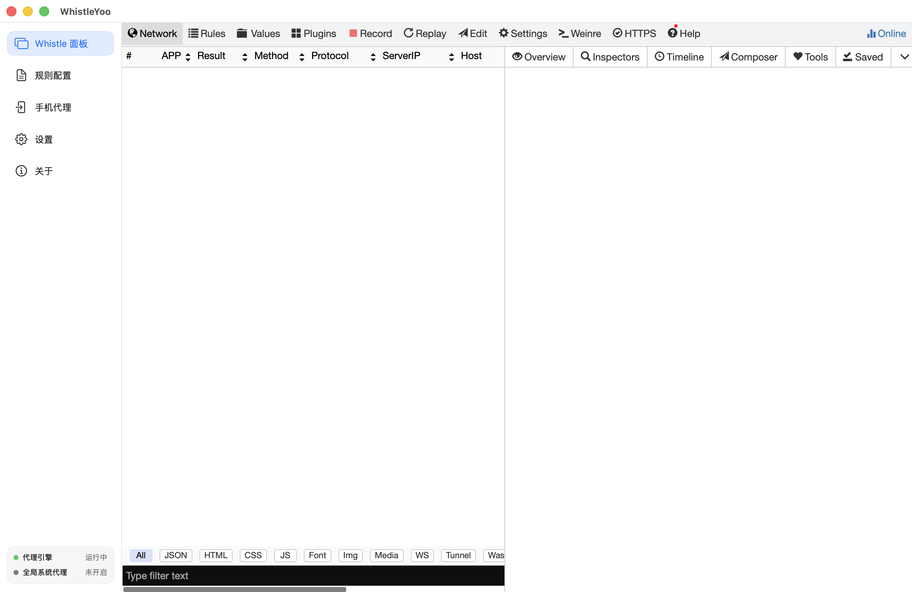
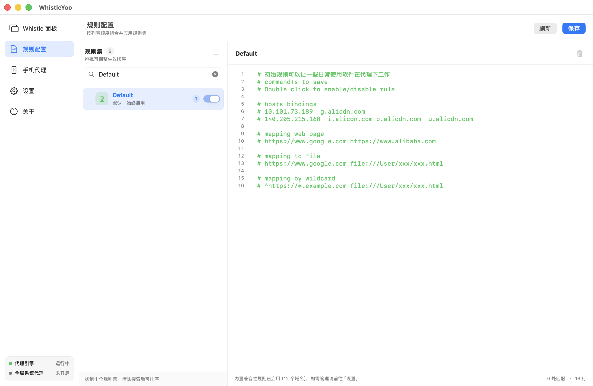
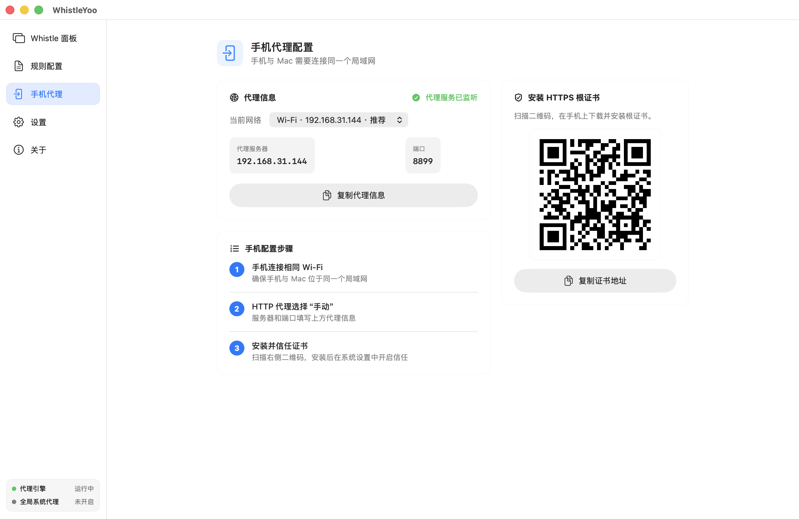
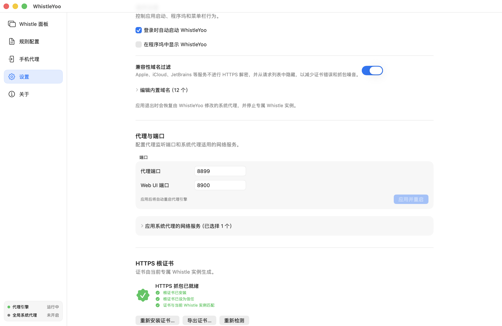

<p align="center">
  
</p>

<h1 align="center">WhistleYoo</h1>

<p align="center">
  让 Whistle 在 macOS 上拥有原生的菜单栏控制、系统代理管理和日常配置体验。
</p>

<p align="center">
  <a href="README.md">English</a> · <strong>简体中文</strong>
</p>

<p align="center">
  <a href="https://github.com/Jeff2Ma/WhistleYoo/releases/latest"></a>
  
  <a href="LICENSE"></a>
</p>

WhistleYoo 是面向 [Whistle](https://github.com/avwo/whistle) 用户的开源 macOS 控制端。它使用你电脑上已有的 Node.js 和全局 Whistle，在独立 storage 中运行专属实例，并把常用操作整合进原生应用：启动代理、接管系统流量、查看请求、管理规则、配置手机代理和维护 HTTPS 根证书。

<p align="center">
  
</p>

## 为什么使用 WhistleYoo

- **菜单栏常驻**：一眼看到引擎和系统代理状态，随时启动、停止或退出。
- **原生系统代理管理**：按网络服务接入 Mac 流量，退出时恢复由 WhistleYoo 修改的代理设置。
- **完整 Whistle 面板**：在应用内查看请求、Inspectors、Timeline、Composer 等 Whistle 功能。
- **原生规则管理**：搜索、创建、启停和排序 Whistle 规则集，支持完整 Whistle 规则语法。
- **手机抓包向导**：直接复制局域网代理信息，通过二维码下载 HTTPS 根证书。
- **独立且可迁移**：不占用 Whistle 的默认 storage；设置和规则可以保存为一份 JSON 配置。
- **中英文界面与应用内更新**：跟随系统语言，并可通过 Sparkle 检查新版本。

## 下载与要求

从 [GitHub Releases](https://github.com/Jeff2Ma/WhistleYoo/releases/latest) 下载最新的 Universal DMG。安装包同时支持 Apple 芯片和 Intel Mac。

运行 WhistleYoo 前需要准备：

| 项目 | 最低要求 |
| --- | --- |
| macOS | 13 Ventura 或更高版本 |
| Node.js | 18 或更高版本 |
| Whistle | 2.9 或更高版本，需全局安装 |

如果尚未安装 Whistle：

```bash
npm install -g whistle
```

可以先在终端确认环境：

```bash
node --version
w2 -V
```

WhistleYoo 会自动查找 Homebrew、NVM、FNM、Volta 以及常见本地安装目录中的 Node.js 和 Whistle。

> WhistleYoo 不会捆绑或替你升级 Node.js、Whistle。这样可以继续使用你熟悉的版本管理方式，同时避免应用内置一套不可见的运行环境。

## 安装

1. 下载并打开 `WhistleYoo-X.Y.Z.dmg`。
2. 将 `WhistleYoo.app` 拖入“应用程序”文件夹。
3. 从“应用程序”中打开 WhistleYoo，按设置助手完成首次检查。

目前公开安装包使用 ad-hoc 代码签名，尚未经过 Apple Developer ID 签名与公证。首次打开时 macOS 可能提示“无法验证开发者”；请确认安装包来自本仓库的 Releases 页面，然后在 Finder 中按住 Control 点击应用，选择“打开”并再次确认。

## 第一次使用

首次启动会出现设置助手，依次完成以下步骤：

1. **检查运行环境**：确认 Node.js 和 Whistle 已就绪；缺失时可直接复制安装命令并重新检测。
2. **检查端口**：默认代理端口为 `8899`，Web UI 端口为 `8900`；如有冲突可在向导中修改。
3. **安装 HTTPS 根证书**：需要查看 HTTPS 明文时安装；只抓取 HTTP 或暂时不解密 HTTPS 时可以跳过。
4. **完成设置**：代理引擎已启动，可选择是否立即开启“全局系统代理”。

后续正常启动会保持空闲，不会自动接管 Mac 流量。需要使用时点击菜单栏图标，先启动代理引擎，再按需开启“全局系统代理”。

### 理解两个开关

- **代理引擎**控制 WhistleYoo 的专属 Whistle 实例。启动后，手动代理和手机代理已经可以使用。
- **全局系统代理**把所选 macOS 网络服务的流量接入该实例。它关闭时，Mac 流量不会自动经过 Whistle，但手机和手动配置的客户端仍然可用。

关闭主窗口不会退出菜单栏应用。结束使用时请从菜单栏面板点击“关闭并退出”，WhistleYoo 会先恢复由它管理的系统代理，再停止专属 Whistle 实例。

## 查看和调试请求

启动代理后，点击“Whistle 面板”进入内嵌 Web UI。这里保留 Whistle 熟悉的 Network、Inspectors、Timeline、Replay、Composer 等工作流，适合查看请求详情、重放请求和调试接口。



如果只想临时代理某个应用，也可以保持“全局系统代理”关闭，把该应用的 HTTP/HTTPS 代理手动设为 `127.0.0.1:8899`。

## 管理 Whistle 规则

“规则配置”直接读写专属 Whistle 实例中的 Rules 数据，不会维护另一份互不生效的规则：

- 按名称或内容搜索规则集；
- 新建、重命名或删除自定义规则集；
- 同时启用多个规则集，并通过拖拽调整生效顺序；
- 编辑完整 Whistle 规则语法，使用 `Command + S` 保存；
- 在刷新或离开前提示尚未保存的修改。

`Default` 是 WhistleYoo 管理的保留规则集，始终启用且不可编辑、重命名或删除。兼容性域名过滤也会通过该规则集生效，并统一在“设置”中管理。



规则语法请参考 [Whistle 官方文档](https://wproxy.org/whistle/)。

## 抓取手机流量

1. 让手机和 Mac 连接到同一个局域网。
2. 启动代理引擎，打开“手机代理”。
3. 选择标有“推荐”的物理网络地址，并复制代理信息。
4. 在手机当前 Wi-Fi 的 HTTP 代理设置中选择“手动”，填入页面显示的服务器和端口。
5. 如需抓取 HTTPS，扫描页面二维码，在手机上安装并信任根证书。



手机连接失败时，优先确认两台设备位于同一局域网、填写的是推荐的局域网 IP，并检查 macOS 防火墙或 Wi-Fi 的客户端隔离设置。

## 设置、证书与配置文件

设置页可以管理：

- 登录时启动、是否在程序坞显示；
- 代理端口、Web UI 端口和应用系统代理的网络服务；
- HTTPS 根证书的安装、信任以及与当前实例是否匹配；
- Apple、iCloud、JetBrains 等服务的兼容性域名过滤；
- WhistleYoo 配置文件的位置、导入和导出。



默认配置文件位于：

```text
~/Library/Application Support/com.devework.whistleyoo/WhistleYoo.json
```

该 JSON 同时包含应用设置和完整规则快照。你可以在设置中改到 iCloud Drive 或其他同步目录，在多台 Mac 间复用配置；配置中可能包含本地路径、域名和完整规则，请不要直接上传到公开位置。

## 常见问题

### 提示找不到 Node.js 或 Whistle

确认版本符合要求，并在终端运行 `npm install -g whistle`。如果刚完成安装，回到设置助手或“设置 → 运行环境”点击“重新检测”。

### 代理引擎无法启动

默认的 `8899` 或 `8900` 端口可能已被其他程序占用。前往“设置 → 代理与端口”更换端口；WhistleYoo 不会在冲突时静默选择随机端口。

### Whistle 面板里没有 Mac 请求

先确认代理引擎正在运行。需要自动接入 Mac 流量时，还要开启“全局系统代理”；如果只代理特定应用，请检查该应用的手动代理地址和端口。

### 能看到 HTTPS 请求，但看不到明文内容

前往“设置 → HTTPS 根证书”，确认“已安装”“已设为信任”和“与当前 Whistle 实例匹配”均为正常状态。兼容性域名过滤中的服务会有意跳过 HTTPS 解密并从请求列表隐藏。

### 为什么程序坞中没有 WhistleYoo

WhistleYoo 默认以菜单栏应用运行。点击菜单栏图标即可打开控制面板，也可以在设置中开启“在程序坞中显示 WhistleYoo”。

## 更新、反馈与隐私说明

- 在“关于 → 检查更新”中获取新版本；更新包会通过 Sparkle EdDSA 签名校验。
- 遇到问题或有功能建议，请提交 [GitHub Issue](https://github.com/Jeff2Ma/WhistleYoo/issues)。
- WhistleYoo 在本机启动并管理 Whistle，配置、规则和证书记录保存在当前用户目录中；应用本身不提供云端代理或账号服务。

源码构建、代码签名、Sparkle 密钥和自动发布流程见 [维护者指南](docs/maintainer-guide.md)。

## License

[MIT](LICENSE) © 2026 Jeff Ma
